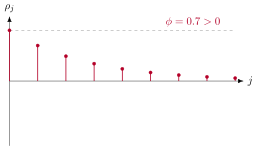

La [Sección “El operador de rezago”](16-el-operador-de-rezago.qmd) construyó, en abstracto, toda el álgebra
necesaria para manipular ecuaciones que relacionan un proceso con sus
propios rezagos; esta sección aplica esa álgebra a la familia de
procesos que la usan de la manera más directa posible: los procesos
autorregresivos, en los que el valor presente de una serie se escribe
como una combinación lineal de sus propios valores pasados más un
choque de ruido blanco. El recorrido tiene cinco etapas. Primero, el
caso más simple, el AR(1), se resuelve por completo, con su solución
hacia atrás, su condición de estacionariedad y todos sus momentos
derivados explícitamente. Segundo, el AR(p) generaliza esa construcción
a $p$ rezagos, y su condición de estacionariedad se obtiene invocando,
sin volver a demostrarlo, el teorema de la
[Sección “El operador de rezago”](16-el-operador-de-rezago.qmd) que relaciona estacionariedad con las raíces
del polinomio característico. Tercero, las ecuaciones de Yule–Walker
traducen la estructura de dependencia del AR(p) en un sistema lineal
que relaciona sus coeficientes con sus autocorrelaciones. Cuarto, la
función de autocorrelación parcial completa el conjunto de herramientas
diagnósticas que, junto con la función de autocorrelación ordinaria,
permitirá identificar el orden de un proceso autorregresivo a partir de
datos observados. Quinto, la representación MA($\infty$) y la forma
compañera del AR(p) cierran la sección conectándola con la
[Sección “El proceso MA(1)”](27-el-proceso-ma-1.qmd) y con la representación espacio-estado de la
[sección sobre la representación espacio-estado](../econometria-3/index.qmd), respectivamente.

::: {#def-ar1}
## Proceso autorregresivo de orden uno

Un proceso $\{Y_t\}$ sigue un ***AR(1)*** si
$Y_t=\phi Y_{t-1}+\rblanco_t$, con $\phi\in\mathbb{R}$ y
$\{\rblanco_t\}$ ruido blanco con varianza $\sigma^2$. En notación de
rezagos, $(1-\phi\Lag)Y_t=\rblanco_t$.
:::

La ecuación en diferencias del AR(1) se resuelve hacia atrás, y el resultado depende de que el coeficiente sea menor que uno en valor absoluto.

::: {#thm-solucion-ar1}
## Solución hacia atrás del AR(1) y condición de convergencia

Si $|\phi|<1$, el AR(1) de la @def-ar1 admite la solución

$$
Y_t = \sum_{j=0}^{\infty}\phi^j\rblanco_{t-j},
$$

convergente en media cuadrática, y esta solución es débilmente
estacionaria.
:::

::: {.proof}
Es la aplicación directa del [Teorema “Inversión de un polinomio de rezagos de primer orden”](19-inversion-de-polinomios-de-rezagos.qmd#thm-inversion-polinomio-primer-orden)
de la [Sección “El operador de rezago”](16-el-operador-de-rezago.qmd) al polinomio $\phi(\Lag)=1-\phi\Lag$:
bajo $|\phi|<1$, ese teorema garantiza que
$\phi(\Lag)^{-1}=\sum_{j=0}^{\infty}\phi^j\Lag^j$ existe como límite en
media cuadrática y satisface $\phi(\Lag)[\phi(\Lag)^{-1}\rblanco_t]=
\rblanco_t$, de modo que
$Y_t=\phi(\Lag)^{-1}\rblanco_t=\sum_{j=0}^{\infty}\phi^j\rblanco_{t-j}$
resuelve la ecuación $(1-\phi\Lag)Y_t=\rblanco_t$. La estacionariedad
débil de esta solución es el caso particular $p=1$ del
[Teorema “Condición de estacionariedad de un proceso autorregresivo”](21-la-condicion-de-estacionariedad-en-terminos-de-r.qmd#thm-condicion-estacionariedad-raices) de la
[Sección “El operador de rezago”](16-el-operador-de-rezago.qmd), porque la única raíz del polinomio
característico $\phi(z)=1-\phi z$ es $z=1/\phi$, que satisface
$|1/\phi|>1$ exactamente cuando $|\phi|<1$.
:::

Cuando $|\phi|\geq 1$, en cambio, no existe ninguna solución débilmente
estacionaria: el caso $\phi=1$ reproduce exactamente el paseo aleatorio
de la [Sección “Procesos sin dinámica: constante, ruido blanco y media”](12-procesos-sin-dinamica-constante-ruido-blanco-y-m.qmd), y el caso $|\phi|>1$ produce una
solución que se aleja geométricamente del origen sin límite, ninguna de
las dos compatible con varianza constante en el tiempo. En lo que sigue
de esta subsección se supone $|\phi|<1$, la condición que hace del
AR(1) un modelo útil para datos económicos que fluctúan alrededor de un
nivel estable.

::: {#prp-momentos-ar1}
## Momentos del AR(1)

Para el AR(1) estacionario de la @thm-solucion-ar1,
$\Esp{Y_t}=0$, $\Var(Y_t)=\sigma^2/(1-\phi^2)$, y para $j\geq 0$,
$\autocov{j}=\phi^j\sigma^2/(1-\phi^2)$, de modo que
$\autocorr{j}=\phi^j$.
:::

::: {.proof}
La media se sigue de aplicar la esperanza término a término a la
solución del @thm-solucion-ar1,
$\Esp{Y_t}=\sum_{j=0}^{\infty}\phi^j\Esp{\rblanco_{t-j}}=0$, porque cada
$\Esp{\rblanco_{t-j}}=0$. Para la varianza, como los términos
$\rblanco_{t-j}$ son incorrelacionados entre sí por ser ruido blanco, la
[Proposición “Covarianza de una transformación lineal”](../econometria-1/09-vector-de-medias-y-matriz-de-covarianzas.qmd#prp-covarianza-transformacion-lineal) de la
[Sección “Vector de medias y matriz de covarianzas”](../econometria-1/09-vector-de-medias-y-matriz-de-covarianzas.qmd), extendida a una combinación lineal infinita,
da

$$
\Var(Y_t) = \sum_{j=0}^{\infty}\phi^{2j}\Var(\rblanco_{t-j})
  = \sigma^2\sum_{j=0}^{\infty}(\phi^2)^j
  = \frac{\sigma^2}{1-\phi^2},
$$

donde la última igualdad es la suma de la serie geométrica de razón
$\phi^2\in[0,1)$ de la [Sección “Sucesiones y su límite”](../matematica-1/17-sucesiones-y-su-limite.qmd). Para la autocovarianza de
orden $j\geq 0$, sustituyendo la solución del
@thm-solucion-ar1 para $Y_t$ y para $Y_{t-j}$,

$$
\begin{aligned}
\autocov{j} = \Cov(Y_t,Y_{t-j})
  &= \Cov\Bigl(\sum_{i=0}^{\infty}\phi^i\rblanco_{t-i},\,
  \sum_{k=0}^{\infty}\phi^k\rblanco_{t-j-k}\Bigr),
   \\
  \autocov{j}
  &= \sum_{i=0}^{\infty}\phi^i\phi^{i-j}\sigma^2
  = \phi^{-j}\sigma^2\sum_{i=j}^{\infty}\phi^{2i}
  = \phi^j\,\frac{\sigma^2}{1-\phi^2},
\end{aligned}
$$ {#eq-autocov-ar1-1}

donde @eq-autocov-ar1-1 conserva únicamente los términos con
$t-i=t-j-k$, es decir $i=j+k$, los únicos pares con covarianza no nula
por ser $\{\rblanco_t\}$ ruido blanco, y la suma resultante, reindexada
en $i=j+k$ con $k\geq 0$, vuelve a ser una serie geométrica de razón
$\phi^2$ que arranca en $i=j$ en lugar de en $i=0$. Dividiendo
$\autocov{j}$ entre $\autocov{0}=\sigma^2/(1-\phi^2)$ se obtiene
directamente $\autocorr{j}=\phi^j$.
:::

{#fig-fac-ar1 fig-alt=“Función de autocorrelación de un AR(1) con $\phi=0.7$: decae geométricamente hacia cero sin cortarse nunca en ningún rezago finito. Cuando $\phi<0$, la misma fórmula $\rho_j=\phi^j$ produce un decaimiento con signo alternante en lugar de monótono.”}

El resultado $\autocorr{j}=\phi^j$ es, quizás, la fórmula más
recordada de toda la econometría de series de tiempo elementales: dice
que la memoria de un AR(1) decae geométricamente, nunca desaparece por
completo en ningún rezago finito, y lo hace más rápido cuanto más
pequeño es $|\phi|$ en valor absoluto. Ese decaimiento geométrico sin
corte abrupto, ilustrado en la @fig-fac-ar1, es la firma que
distingue a un proceso autorregresivo de un proceso de medias móviles,
cuya función de autocorrelación sí se corta abruptamente, como mostrará
la [Sección “El proceso MA(1)”](27-el-proceso-ma-1.qmd).
