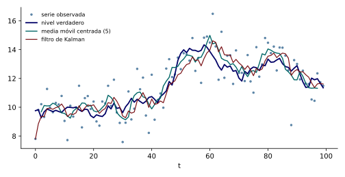

Los bancos centrales toman decisiones con base en magnitudes que nadie observa. La brecha del producto compara el producto efectivo con el que la economía podría sostener sin presiones inflacionarias, la tasa de interés natural es la tasa real compatible con esa situación, y la inflación subyacente es la parte persistente de la inflación. Ninguna de las tres aparece en las cuentas nacionales. Lo que sí se observa es una serie con ruido, que mezcla la magnitud de interés con errores de medición, estacionalidad y movimientos transitorios. Esta nota plantea el problema de extraer lo no observable de lo observado, muestra por qué las herramientas elementales fallan y motiva el modelo que se construye en el resto de la unidad.

El planteamiento más simple descompone la serie observada $y_t$ en componentes con significado económico: una ***tendencia*** $T_t$ de movimiento lento, una ***estacionalidad*** $S_t$ que se repite con período fijo y un componente ***irregular*** $I_t$ sin patrón. En forma aditiva, $y_t=T_t+S_t+I_t$, y en forma multiplicativa, $y_t=T_tS_tI_t$, que se vuelve aditiva al tomar logaritmos. Cada componente es una variable aleatoria que no se observa, y el problema es estimarla a partir de $y_1,\ldots,y_n$. Tres herramientas elementales se usan para ello, y cada una resuelve parte del problema.

La primera es la media móvil, que estima el nivel de la serie en $t$ promediando valores cercanos. La media móvil centrada de longitud $2k+1$ es $\hat\mu_t=\tfrac1{2k+1}\sum_{j=-k}^k y_{t+j}$. Reduce el ruido, pero tiene dos defectos. Exige valores futuros, de modo que no puede calcularse en los últimos $k$ períodos, que son los que más interesan a quien toma decisiones, y su versión unilateral, $\tfrac1{k+1}\sum_{j=0}^ky_{t-j}$, llega con retraso. La segunda es la regresión sobre una tendencia determinista, que supone que el nivel crece a una tasa fija conocida. La tercera es la diferenciación, que elimina el nivel pero destruye la información sobre él. Ninguna de las tres tiene un criterio que diga cuál es la mejor estimación posible.

El error de la media móvil se puede calcular exactamente en un modelo simple. Sea $y_t=\mu_t+\varepsilon_t$, donde el nivel sigue un paseo aleatorio, $\mu_t=\mu_{t-1}+\eta_t$, con $\eta_t\sim\mathrm{RB}(0,\sigma_\eta^2)$, y el error de medición $\varepsilon_t\sim\mathrm{RB}(0,\sigma_\varepsilon^2)$ es no correlacionado con el nivel. El resultado siguiente cuantifica el costo de usar una media móvil.

::: {#prp-error-media-movil}
## Error cuadrático medio de una media móvil

Para el modelo anterior, la media móvil centrada de longitud $2k+1$ estima el nivel con error cuadrático medio $\E[(\hat\mu_t-\mu_t)^2]=\dfrac{\sigma_\varepsilon^2}{2k+1}+\dfrac{k(k+1)}{3(2k+1)}\,\sigma_\eta^2$.

:::

::: {.proof}
Se escribe $\hat\mu_t-\mu_t=\tfrac1{2k+1}\sum_{j=-k}^k(\mu_{t+j}-\mu_t)+\tfrac1{2k+1}\sum_{j=-k}^k\varepsilon_{t+j}$. Los dos sumandos no están correlacionados. La varianza del segundo es $\sigma_\varepsilon^2/(2k+1)$. Para el primero, $\mu_{t+j}-\mu_t=\sum_{i=1}^j\eta_{t+i}$ si $j>0$ y $-\sum_{i=j+1}^{0}\eta_{t+i}$ si $j<0$, de modo que $\Cov(\mu_{t+j}-\mu_t,\mu_{t+l}-\mu_t)=\min\{|j|,|l|\}\sigma_\eta^2$ si $j,l$ tienen el mismo signo, porque comparten los incrementos entre $t$ y el más cercano, y $0$ si tienen signos opuestos, porque usan incrementos distintos. La varianza de la suma es $\sigma_\eta^2\sum_{j,l}c_{jl}$, con $c_{jl}=\min\{|j|,|l|\}$ si $j,l$ tienen el mismo signo y $0$ en otro caso. Cada signo aporta $\sum_{j,l=1}^k\min\{j,l\}=k(k+1)(2k+1)/6$, porque $\min\{j,l\}$ cuenta los $m$ con $1\leq m\leq\min\{j,l\}$, de modo que la suma es $\sum_{m=1}^k(k-m+1)^2=k(k+1)(2k+1)/6$. Entre los dos signos suman $k(k+1)(2k+1)/3$, y al dividir por $(2k+1)^2$ se obtiene la fórmula.

:::

Con $k=2$, los pares con el mismo signo dan, para cada lado, la matriz $\left(\begin{smallmatrix}1&1\\1&2\end{smallmatrix}\right)$ con suma $5$, de modo que $\sum c_{jl}=10$ y el error cuadrático medio es $\sigma_\varepsilon^2/5+0.4\,\sigma_\eta^2$. Con $\sigma_\varepsilon^2=1$ y $\sigma_\eta^2=0.09$ resulta $0.2+0.036=0.236$, es decir, una raíz del error cuadrático medio de $0.486$. La versión unilateral, que promedia $y_t,\ldots,y_{t-4}$, tiene un error cuadrático medio de $0.308$, mayor, porque el nivel se mueve entre las fechas promediadas y el promedio queda rezagado.

Para ver el problema, se simuló una serie con $n=100$, $\sigma_\varepsilon=1$ y $\sigma_\eta=0.3$ (semilla fija). La @fig-nivel-no-observable muestra la serie observada, el nivel verdadero, que en la práctica no se conoce, y dos estimaciones: la media móvil centrada, que no existe en los dos últimos períodos, y el filtro de Kalman que se construye en esta unidad.

{#fig-nivel-no-observable fig-alt="Puntos de la serie observada, línea del nivel verdadero, media móvil centrada que termina dos períodos antes del final y línea del filtro de Kalman que llega hasta el último período."}

Las líneas de la media móvil y del filtro siguen de cerca el nivel verdadero en el interior de la muestra, y la media móvil no llega a los últimos dos períodos, mientras que el filtro sí. En las 95 fechas desde $t=6$, la raíz del error cuadrático medio de la serie observada respecto del nivel es $1.16$, la de la media móvil unilateral es $0.65$, la del filtro de Kalman es $0.61$ y la del suavizador de la misma familia, que usa toda la muestra, es $0.42$. En las últimas diez fechas, las cifras son $0.73$, $0.58$, $0.49$ y $0.37$. Aprovechar bien la información disponible reduce el error, y la forma óptima de hacerlo es lo que desarrollan las notas siguientes.

El modelo que se usa para ello tiene una estructura de dos ecuaciones. Una dice cómo se mueve el componente no observable, la ecuación de transición, y la otra dice cómo se relaciona con lo observado, la ecuación de medición. Un modelo así se llama de espacio-estado, y el filtro de Kalman es el algoritmo que, a medida que llegan los datos, calcula la mejor estimación lineal del componente no observable. La siguiente nota cuenta de dónde viene ese algoritmo, y la tercera define el modelo.
