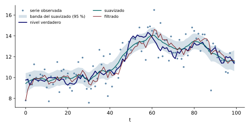

El nivel local es el modelo de componentes no observables más simple: una serie que oscila alrededor de un nivel que se desplaza al azar. Por eso es el mejor lugar para ver qué hace el filtro de Kalman.

Esta nota prueba dos hechos sobre él. Primero, el filtro estabilizado es un promedio móvil exponencial. Segundo, la serie diferenciada es un MA(1): el nivel local es un ARIMA(0,1,1).

## El modelo y su filtro

El modelo de la [definición de nivel local](05-construccion-de-matrices-i-nivel-y-tendencia.qmd#def-nivel-local) tiene dos ecuaciones, una de medición y otra de transición:

$$
\begin{aligned}
y_t &= \mu_t + \varepsilon_t, & \varepsilon_t &\sim \N(0,\sigma_\varepsilon^2), \\[6pt]
\mu_t &= \mu_{t-1} + \eta_t, & \eta_t &\sim \N(0,\sigma_\eta^2),
\end{aligned}
$$

con $\varepsilon_t$ y $\eta_t$ independientes.

La razón señal-ruido $q=\sigma_\eta^2/\sigma_\varepsilon^2$ resume cuánto se mueve el nivel en comparación con el ruido de medición. Si $q$ es pequeña, casi todo el movimiento de la serie es ruido; si es grande, casi todo es nivel.

Como $\mat{Z}=\mat{T}=1$, el filtro de Kalman se escribe con escalares. En cada fecha $t$ aparecen cinco cantidades.

$$
\begin{aligned}
v_t &= y_t - a_{t\mid t-1}, && \text{innovación,} \\[6pt]
F_t &= P_{t\mid t-1} + \sigma_\varepsilon^2, && \text{varianza de la innovación,} \\[6pt]
K_t &= \frac{P_{t\mid t-1}}{F_t}, && \text{ganancia,} \\[6pt]
a_{t+1\mid t} &= a_{t\mid t-1} + K_t\,v_t, && \text{predicción del nivel,} \\[6pt]
P_{t+1\mid t} &= P_{t\mid t-1}\,(1-K_t) + \sigma_\eta^2, && \text{varianza de la predicción.}
\end{aligned}
$$ {#eq-nl-filtro}

Son las ecuaciones de la [etapa de actualización](12-el-filtro-de-kalman-ii-actualizacion.qmd) con $m=N=1$ y con la predicción de un periodo adelante, $a_{t+1\mid t}=a_{t\mid t}$ y $P_{t+1\mid t}=P_{t\mid t}+\sigma_\eta^2$.

## La ganancia de largo plazo

La varianza $P_{t\mid t-1}$ no depende de los datos: solo depende de los dos parámetros y del valor inicial. Entonces cabe preguntar adónde converge la recursión, porque la respuesta fija la ganancia que el filtro usa una vez estabilizado.

::: {#prp-nl-estacionario}
## Estado estacionario del nivel local

Sean $\sigma_\eta^2>0$, $\sigma_\varepsilon^2>0$ y $P_{1\mid0}\geq0$ finito. Entonces:

(i) $P_{t\mid t-1}$ converge a $P^*$, la única raíz positiva de $P^2-\sigma_\eta^2P-\sigma_\eta^2\sigma_\varepsilon^2=0$.

(ii) $K_t$ converge a $K=P^*/(P^*+\sigma_\varepsilon^2)\in(0,1)$.
:::

La recursión de la varianza es una función de $P_{t\mid t-1}$ solamente, y eso permite estudiarla como una sucesión de punto fijo.

::: {.proof}
Se sustituye $K_t=P_{t\mid t-1}/(P_{t\mid t-1}+\sigma_\varepsilon^2)$ en la última ecuación de la @eq-nl-filtro. Resulta $P_{t+1\mid t}=g(P_{t\mid t-1})$ con

$$
g(P) = \frac{P\,\sigma_\varepsilon^2}{P+\sigma_\varepsilon^2} + \sigma_\eta^2.
$$

Un punto fijo $P=g(P)$ cumple, al multiplicar por $P+\sigma_\varepsilon^2$,

$$
\begin{aligned}
P\,(P+\sigma_\varepsilon^2) &= P\,\sigma_\varepsilon^2 + \sigma_\eta^2\,(P+\sigma_\varepsilon^2), \\[6pt]
P^2 + P\,\sigma_\varepsilon^2 &= P\,\sigma_\varepsilon^2 + \sigma_\eta^2 P + \sigma_\eta^2\sigma_\varepsilon^2, \\[6pt]
P^2 &= \sigma_\eta^2 P + \sigma_\eta^2\sigma_\varepsilon^2.
\end{aligned}
$$

El producto de las dos raíces de esta cuadrática es $-\sigma_\eta^2\sigma_\varepsilon^2<0$. Una raíz es entonces positiva y la otra negativa, y la positiva es

$$
P^* = \frac{\sigma_\eta^2 + \sqrt{\sigma_\eta^4 + 4\,\sigma_\eta^2\sigma_\varepsilon^2}}{2}.
$$

Falta probar que la sucesión converge a $P^*$. La derivada de $g$ es

$$
g'(P) = \frac{\sigma_\varepsilon^4}{(P+\sigma_\varepsilon^2)^2} > 0,
$$

así que $g$ es creciente y, para $t\geq2$, $P_{t\mid t-1}\geq g(0)=\sigma_\eta^2$. En el intervalo $[\sigma_\eta^2,\infty)$, que $g$ envía a sí mismo, la derivada está acotada por

$$
g'(P) \leq \frac{\sigma_\varepsilon^4}{(\sigma_\eta^2+\sigma_\varepsilon^2)^2} < 1.
$$

Por tanto $g$ es una contracción en ese intervalo, y el teorema del punto fijo de Banach asegura que $P_{t\mid t-1}\to P^*$. Como $P^*>0$, la ganancia límite $K=P^*/(P^*+\sigma_\varepsilon^2)$ queda en $(0,1)$.
:::

Un caso numérico confirma el cálculo. Con $\sigma_\varepsilon^2=1$ y $\sigma_\eta^2=0.5$ resulta

$$
P^* = \frac{0.5+\sqrt{0.25+2}}{2} = \frac{0.5+1.5}{2} = 1,
\qquad
K = \frac{1}{1+1} = 0.5,
\qquad
F = P^*+\sigma_\varepsilon^2 = 2.
$$

La ganancia depende de los parámetros solo a través de $q$. Dividiendo la ecuación del punto fijo por $\sigma_\varepsilon^4$ y usando $K=p/(1+p)$ con $p=P^*/\sigma_\varepsilon^2$, se llega a una ecuación para $K$ que no contiene ningún parámetro por separado:

$$
\begin{aligned}
p^2 &= q\,p + q, \\[6pt]
\frac{K^2}{(1-K)^2} &= \frac{q}{1-K}, \\[6pt]
K^2 &= q\,(1-K).
\end{aligned}
$$

La segunda línea sustituye $p=K/(1-K)$, que sale de despejar $p$ en $K=p/(1+p)$; la tercera multiplica por $(1-K)^2$. Con $q=0.09$, la raíz positiva de $K^2+qK-q=0$ es $K=0.258$.

## El filtro como promedio móvil exponencial

Con ganancia constante, la actualización del nivel pesa cada dato pasado por una potencia de $1-K$. Lo que sigue lo demuestra.

::: {#cor-nl-ewma}
## Promedio móvil exponencial

Si $K_t=K$ para todo $t$, entonces

$$
a_{t+1\mid t} = K\sum_{j=0}^{t-1}(1-K)^j\,y_{t-j} + (1-K)^t\,a_{1\mid0}.
$$
:::

La fórmula separa el pasado en dos partes: una media ponderada de los datos y el valor inicial, cuyo peso decae geométricamente.

::: {.proof}
Se sustituye $v_t=y_t-a_{t\mid t-1}$ en la ecuación de $a_{t+1\mid t}$ de la @eq-nl-filtro:

$$
\begin{aligned}
a_{t+1\mid t} &= a_{t\mid t-1} + K\,(y_t-a_{t\mid t-1}), \\[6pt]
a_{t+1\mid t} &= (1-K)\,a_{t\mid t-1} + K\,y_t.
\end{aligned}
$$

Se procede por inducción sobre $t$. Para $t=1$ la fórmula del enunciado es $a_{2\mid1}=K\,y_1+(1-K)\,a_{1\mid0}$, que es la ecuación anterior.

Si la fórmula vale para $t-1$, se sustituye $a_{t\mid t-1}$ en la ecuación anterior:

$$
\begin{aligned}
a_{t+1\mid t} &= (1-K)\,a_{t\mid t-1} + K\,y_t, \\[6pt]
a_{t+1\mid t} &= (1-K)\Bigl[K\sum_{j=0}^{t-2}(1-K)^j\,y_{t-1-j} + (1-K)^{t-1}a_{1\mid0}\Bigr] + K\,y_t, \\[6pt]
a_{t+1\mid t} &= K\,y_t + K\sum_{j=1}^{t-1}(1-K)^j\,y_{t-j} + (1-K)^t\,a_{1\mid0}.
\end{aligned}
$$

En la última línea el índice $j$ del paso anterior se corrió una unidad, y el término $K\,y_t$ es el de $j=0$. Reunidos, dan la suma del enunciado.
:::

Los pesos $K(1-K)^j$ suman uno cuando $t$ crece, porque son los términos de una serie geométrica:

$$
K\sum_{j=0}^{\infty}(1-K)^j = \frac{K}{1-(1-K)} = 1.
$$

El peso del dato de hace $j$ periodos cae como $(1-K)^j$. Si $K$ es grande, la estimación sigue de cerca al último dato; si es pequeño, promedia una ventana larga. Como $K$ depende solo de $q$, un nivel que cambia poco respecto del ruido (con $q$ pequeña) produce un filtro de memoria larga.

## Equivalencia con un ARIMA(0,1,1)

El mismo modelo se puede leer en el lenguaje de los procesos ARIMA, y la ganancia aparece como el parámetro de media móvil. ¿Cuál es la relación exacta?

::: {#thm-nl-arima}
## El nivel local es un ARIMA(0,1,1)

En el estado estacionario del filtro, la serie diferenciada cumple

$$
\Delta y_t = v_t - (1-K)\,v_{t-1},
$$

donde $v_t$ es ruido blanco de varianza $F=P^*+\sigma_\varepsilon^2$. Por tanto $y_t$ es un ARIMA(0,1,1) con parámetro de media móvil $\theta=K-1\in(-1,0)$ y autocovarianzas

$$
\gamma_{\Delta y}(0)=\sigma_\eta^2+2\sigma_\varepsilon^2,
\qquad
\gamma_{\Delta y}(1)=-\sigma_\varepsilon^2.
$$
:::

El resultado dice que la constante de suavizamiento es $K=1+\theta$. La demostración tiene tres partes: la forma de $\Delta y_t$, las autocovarianzas del MA(1) que resulta y su coincidencia con las del modelo original.

::: {.proof}
Se parte de $y_t=a_{t\mid t-1}+v_t$ y de $a_{t+1\mid t}=a_{t\mid t-1}+K\,v_t$. La diferencia de $y$ entre dos fechas seguidas es

$$
\begin{aligned}
y_{t+1}-y_t &= (a_{t+1\mid t}-a_{t\mid t-1}) + v_{t+1} - v_t, \\[6pt]
y_{t+1}-y_t &= K\,v_t + v_{t+1} - v_t, \\[6pt]
y_{t+1}-y_t &= v_{t+1} - (1-K)\,v_t.
\end{aligned}
$$

Las innovaciones no están correlacionadas y tienen varianza $F$, así que $\Delta y_{t+1}$ es un MA(1) con $\theta=-(1-K)$.

Para las autocovarianzas se usa $1-K=\sigma_\varepsilon^2/F$, que sale de $1-K=(F-P^*)/F$. Entonces

$$
\begin{aligned}
\gamma(1) &= \theta\,F = -(1-K)\,F = -\sigma_\varepsilon^2, \\[6pt]
\gamma(0) &= (1+\theta^2)\,F = F + \frac{\sigma_\varepsilon^4}{F}.
\end{aligned}
$$

La primera coincide con la del modelo original. Falta ver la segunda. En el modelo original, $\Delta y_t=\eta_t+\varepsilon_t-\varepsilon_{t-1}$, y por tanto

$$
\begin{aligned}
\gamma(0) &= \sigma_\eta^2 + \sigma_\varepsilon^2 + \sigma_\varepsilon^2 = \sigma_\eta^2+2\sigma_\varepsilon^2, \\[6pt]
\gamma(1) &= \Cov(\varepsilon_t-\varepsilon_{t-1},\ \varepsilon_{t-1}-\varepsilon_{t-2}) = -\sigma_\varepsilon^2.
\end{aligned}
$$

Las dos expresiones de $\gamma(0)$ coinciden si $F+\sigma_\varepsilon^4/F=\sigma_\eta^2+2\sigma_\varepsilon^2$. Se multiplica por $F$ y se usa $F=P^*+\sigma_\varepsilon^2$:

$$
\begin{aligned}
F^2+\sigma_\varepsilon^4 &= (\sigma_\eta^2+2\sigma_\varepsilon^2)\,F, \\[6pt]
(P^*+\sigma_\varepsilon^2)^2+\sigma_\varepsilon^4 &= (\sigma_\eta^2+2\sigma_\varepsilon^2)(P^*+\sigma_\varepsilon^2), \\[6pt]
P^{*2}+2P^*\sigma_\varepsilon^2+2\sigma_\varepsilon^4 &= \sigma_\eta^2P^*+\sigma_\eta^2\sigma_\varepsilon^2+2\sigma_\varepsilon^2P^*+2\sigma_\varepsilon^4, \\[6pt]
P^{*2} &= \sigma_\eta^2P^*+\sigma_\eta^2\sigma_\varepsilon^2.
\end{aligned}
$$

La última línea es la ecuación del estado estacionario de la @prp-nl-estacionario, que $P^*$ cumple por definición.

Queda la invertibilidad. Como $K\in(0,1)$, se tiene $\theta=K-1\in(-1,0)$ y $|\theta|<1$; el MA(1) es invertible.
:::

Con $\sigma_\varepsilon^2=1$ y $\sigma_\eta^2=0.5$ se tiene $\theta=-0.5$ y $F=2$, y las autocovarianzas se calculan a mano:

$$
\begin{aligned}
\gamma(0) &= F\,(1+\theta^2) = 2\,(1+0.25) = 2.5 = \sigma_\eta^2+2\sigma_\varepsilon^2, \\[6pt]
\gamma(1) &= F\,\theta = 2\,(-0.5) = -1 = -\sigma_\varepsilon^2.
\end{aligned}
$$

La autocorrelación $\rho(1)=-1/2.5=-0.4$ admite dos valores de $\theta$ que la generan:

$$
\frac{\theta}{1+\theta^2} = -0.4
\quad\Longleftrightarrow\quad
\theta^2+2.5\,\theta+1=0
\quad\Longleftrightarrow\quad
\theta\in\{-0.5,\ -2\}.
$$

Las dos raíces son recíprocas, como en la [reflexión de raíces de la nota de invertibilidad](../econometria-2/20-invertibilidad.qmd). El filtro coincide con la invertible, $\theta=-0.5$.

## Un ejemplo con serie simulada

La [primera nota del curso](01-la-variable-economica-no-observable.qmd) simula $100$ datos de un nivel local con $\sigma_\varepsilon^2=1$ y $\sigma_\eta^2=0.09$. Entonces $q=0.09$, y el estado estacionario es

$$
P^*=0.348,
\qquad
K=0.258,
\qquad
\theta=K-1=-0.742.
$$

El nivel cambia poco en comparación con el ruido, y por eso el filtro promedia una ventana larga. La @fig-nivel-local muestra, para esa serie, el filtro, el suavizador y la banda de confianza del suavizador con los parámetros verdaderos.

{#fig-nivel-local fig-alt="Puntos de la serie observada, línea del nivel verdadero, línea del filtro, línea del suavizador y una banda sombreada alrededor del suavizador."}

El suavizador sigue más de cerca el nivel verdadero, y su banda es más angosta que la del filtro. La razón es que usa los datos de ambos lados de cada fecha.

A partir de la décima fecha, el nivel verdadero cae dentro de la banda del $95\,\%$ del suavizador en el $92\,\%$ de las fechas y dentro de la banda análoga del filtro en el $88\,\%$. En una sola muestra de $90$ fechas, esos porcentajes fluctúan alrededor del nominal por la dependencia entre fechas.

La desviación estándar del suavizador en el medio de la muestra es $0.385$ y la del filtro al final es $0.508$, así que

$$
1-\frac{0.385}{0.508} \approx 0.24.
$$

La banda del suavizador es, entonces, un $24\,\%$ más angosta.
