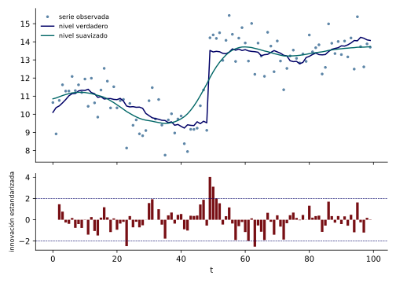

Cuando una serie crece, el nivel local no basta, porque su pronóstico es plano. La tendencia lineal local agrega una pendiente que también cambia lentamente, de modo que la serie puede tener la inercia de una tendencia sin comprometerse con una recta fija. Esta nota usa el filtro y el suavizador para estimar nivel y pendiente, examina cómo reacciona el filtro ante un cambio brusco de nivel que el modelo no contempla, y usa esa reacción para detectar rupturas.

El modelo es el de la definición de tendencia lineal local, con estado $(\mu_t,\beta_t)$, $\mat{Z}=(1,0)$, $\mat{T}=\left(\begin{smallmatrix}1&1\\0&1\end{smallmatrix}\right)$ y varianzas $\sigma_\varepsilon^2,\sigma_\eta^2,\sigma_\zeta^2$. El filtro tiene la forma general: en cada período, la predicción es $\vect{a}_{t\mid t-1}=\mat{T}\vect{a}_{t-1\mid t-1}$, es decir, el nivel predicho es el nivel filtrado más la pendiente filtrada, y la pendiente predicha es la filtrada. La innovación $v_t=y_t-\mu_{t\mid t-1}$ corrige ambos componentes con una ganancia de dos entradas $\vect{K}_t=(K_{\mu},K_{\beta})^{\top}$, que se vuelve constante en el estado estacionario. Con $\sigma_\varepsilon^2=1$, $\sigma_\eta^2=0.01$ y $\sigma_\zeta^2=0.0009$, el estado estacionario tiene $\vect{K}=(0.233,\ 0.026)^{\top}$ y $F=1.303$: la mayor parte de la innovación se atribuye al error de medición, una cuarta parte al nivel y una fracción pequeña a la pendiente, porque la pendiente cambia muy poco.

El caso en que el nivel no tiene perturbación, $\sigma_\eta^2=0$, produce una tendencia suave: el nivel es la integral de una pendiente que sigue un paseo aleatorio, y su trayectoria es más regular que la del paseo con deriva. El suavizador de intervalo fijo entrega, además del nivel, la pendiente estimada en cada fecha, que es la tasa de crecimiento subyacente.

Un cambio brusco de nivel que el modelo no prevé produce una secuencia característica de innovaciones. Sea un salto de tamaño $J$ en el nivel en $t=\tau$ y supóngase que antes el filtro estaba en estado estacionario sin error de estimación. El desplazamiento $\vect{s}_{t\mid t-1}$ del estado predicho respecto de la trayectoria sin salto cumple, para $t\geq\tau$, $v_t=J-\mat{Z}\vect{s}_{t\mid t-1}$ y $\vect{s}_{t+1\mid t}=\mat{T}(\vect{s}_{t\mid t-1}+\vect{K}v_t)=\mat{T}(\Imat-\vect{K}\mat{Z})\vect{s}_{t\mid t-1}+\mat{T}\vect{K}J$, con $\vect{s}_{\tau\mid\tau-1}=\vect{0}$.

::: {#prp-respuesta-salto}
## Respuesta de las innovaciones a un salto de nivel

La recursión anterior tiene como punto fijo $\vect{s}=(J,0)^{\top}$, en el que la innovación es cero, y el estado predicho converge a él si los valores propios de $\mat{T}(\Imat-\vect{K}\mat{Z})$ tienen módulo menor que uno. La primera innovación del salto es $v_\tau=J$ y las siguientes decaen de manera gradual.

:::

::: {.proof}
En $\vect{s}=(J,0)^{\top}$, $\mat{Z}\vect{s}=J$, de modo que $v=J-J=0$ y $\mat{T}(\Imat-\vect{K}\mat{Z})\vect{s}+\mat{T}\vect{K}J=\mat{T}\vect{s}-\mat{T}\vect{K}J+\mat{T}\vect{K}J=\mat{T}\vect{s}=\vect{s}$, porque $\mat{T}(J,0)^{\top}=(J,0)^{\top}$. La recursión es afín con matriz $\mat{A}=\mat{T}(\Imat-\vect{K}\mat{Z})$, y la diferencia respecto del punto fijo evoluciona como $\vect{s}_{t+1}-\vect{s}=\mat{A}(\vect{s}_t-\vect{s})$, que converge a cero si el radio espectral de $\mat{A}$ es menor que uno, por el teorema de potencias de una matriz. En $t=\tau$, $\vect{s}=\vect{0}$ y $v_\tau=J$.

:::

Con números, con los parámetros anteriores y un salto de $4$ (cuatro desvíos estándar del error de medición), las innovaciones estandarizadas esperadas son $3.50,\ 2.60,\ 1.83,\ 1.20,\ 0.68,\ 0.26$ en las seis fechas siguientes al salto: una innovación grande seguida de valores positivos que decaen, a diferencia de un dato atípico aislado, que produce una innovación grande y luego valores pequeños y de signo contrario.

La @fig-tendencia-ruptura muestra una simulación con esos parámetros, un salto de $4$ en el nivel en $t=50$, y el nivel suavizado con los parámetros verdaderos (sin el salto). El suavizador, que supone que el nivel cambia poco, no sigue el salto de inmediato y lo reparte en varias fechas.

{#fig-tendencia-ruptura fig-alt="Panel superior con puntos de la serie observada, nivel verdadero con un salto en t igual a 50 y nivel suavizado que lo sigue de forma gradual. Panel inferior con barras de las innovaciones estandarizadas, con valores mayores que dos en las fechas 50 y 51."}

Las innovaciones estandarizadas, que bajo el modelo correcto son independientes con distribución $\N(0,1)$ por el teorema del algoritmo completo, detectan la ruptura: en la simulación las de $t=50,51,52,53$ valen $4.04,\ 3.11,\ 2.00,\ 1.55$, el patrón de la respuesta al salto. Solo tres de las $98$ innovaciones superan $2.5$ en valor absoluto, las de $t=50$, $51$ y una de la fecha $64$, cuando bajo el modelo correcto se esperaría $98\cdot0.0124=1.2$. Una vez detectada la ruptura, conviene modelarla de manera explícita, con una variable que codifique el salto, para que el filtro no la reparta entre el nivel y el error de medición.
