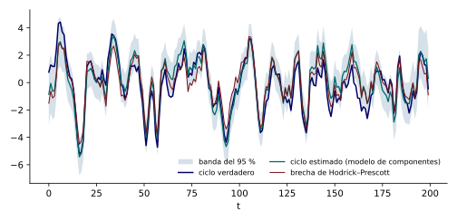

La brecha del producto es el ciclo, la diferencia entre el producto y su tendencia. El filtro de Hodrick–Prescott la estima suponiendo que el ciclo es ruido blanco, lo que contradice la persistencia que se observa en los ciclos económicos. Un modelo de componentes no observables corrige esa limitación: modela la tendencia con nivel y pendiente que cambian, el ciclo como un proceso autorregresivo de segundo orden capaz de oscilar, y estima las varianzas y los coeficientes con los datos. Además entrega, junto con cada estimación del ciclo, la incertidumbre que la acompaña. Esta nota construye ese modelo, lo estima con una serie simulada de la que se conoce el ciclo verdadero, y lo compara con el filtro de Hodrick–Prescott.

::: {#def-tendencia-ciclo}
## Modelo de tendencia y ciclo

El modelo es $y_t=\tau_t+c_t$ con la tendencia $\tau_t=\tau_{t-1}+g_{t-1}+\eta_t$, $g_t=g_{t-1}+\zeta_t$ y el ciclo $c_t=\phi_1c_{t-1}+\phi_2c_{t-2}+\omega_t$, con $\eta_t,\zeta_t,\omega_t$ normales independientes de varianzas $\sigma_\eta^2,\sigma_\zeta^2,\sigma_\omega^2$. Con $\vect{\alpha}_t=(\tau_t,g_t,c_t,c_{t-1})^{\top}$, $\mat{Z}=(1,0,1,0)$, $\mat{H}=0$,
$$
\mat{T}=\begin{pmatrix}1&1&0&0\\0&1&0&0\\0&0&\phi_1&\phi_2\\0&0&1&0\end{pmatrix},\quad\mat{R}=\begin{pmatrix}1&0&0\\0&1&0\\0&0&1\\0&0&0\end{pmatrix},\quad\mat{Q}=\mathrm{diag}(\sigma_\eta^2,\sigma_\zeta^2,\sigma_\omega^2),
$$
con $m=4$, $r=3$ y $N=1$. La inicialización es difusa para $(\tau,g)$ y estacionaria para $(c_t,c_{t-1})$.

:::

La matriz de transición es diagonal por bloques: el bloque de la tendencia es el de la tendencia local y el del ciclo es el del AR(2). El modelo no tiene error de medición, porque el ciclo ya absorbe la parte transitoria de la serie. El ciclo estacionario se parece a un oscilador si las raíces de su polinomio son complejas, y entonces su autocorrelación cambia de signo con un período característico. Con $\phi_1=1.3$ y $\phi_2=-0.5$, el discriminante $\phi_1^2+4\phi_2=1.69-2<0$ da raíces complejas, y el ciclo oscila con un período de $2\pi/\arccos\bigl(\phi_1/(2\sqrt{-\phi_2})\bigr)=2\pi/\arccos(0.919)\approx16$ períodos, es decir, unos cuatro años en datos trimestrales.

Se simuló una serie de $200$ trimestres con una tendencia de pendiente inicial $0.5$, $\sigma_\eta=0.3$, $\sigma_\zeta=0.05$ y un ciclo con $\phi=(1.3,-0.5)$ y $\sigma_\omega=0.8$, de modo que el ciclo verdadero se conoce. La maximización de la verosimilitud difusa, con el filtro y un algoritmo de búsqueda de Nelder–Mead, entregó $\hat\phi=(1.242,-0.445)$, $\hat\sigma_\omega=0.880$, $\hat\sigma_\zeta=0.015$ y $\hat\sigma_\eta\approx0$. Los coeficientes del ciclo se recuperan con buena precisión. La varianza del nivel de la tendencia se estima en cero, un valor en la frontera: cuando una parte de la variación del nivel se confunde con el ciclo persistente, la verosimilitud no distingue bien entre ambos, y el estimador asigna esa variación al ciclo. Es una dificultad conocida de estos modelos, y es una razón para restringir parámetros o usar información externa.

La estimación suavizada del ciclo con los parámetros estimados tiene correlación $0.92$ con el ciclo verdadero y un error cuadrático medio de raíz $0.78$ frente a una desviación estándar del ciclo de $1.85$. La brecha del filtro de Hodrick–Prescott con $\lambda=1600$ tiene correlación $0.93$ y raíz del error cuadrático medio $0.73$: en esta muestra ambos métodos se comportan de manera similar, y el filtro no es peor en el interior. La diferencia aparece en los últimos ocho trimestres, donde el modelo tiene una raíz del error cuadrático medio de $0.44$ y la brecha del filtro de $0.51$, y en lo que el modelo agrega, la incertidumbre.

La @fig-tendencia-ciclo muestra el ciclo verdadero, el estimado por el modelo con su banda del $95\,\%$, y la brecha de Hodrick–Prescott.

{#fig-tendencia-ciclo fig-alt="Línea del ciclo verdadero, línea del ciclo suavizado con una banda sombreada alrededor y línea de la brecha del filtro de Hodrick-Prescott, que son muy parecidas en el interior de la muestra."}

La banda proviene de la varianza suavizada del estado, $\sqrt{P_{t\mid n}}$ para la componente $c_t$. Su ancho no es constante: en el medio de la muestra la desviación estándar es $0.62$ y al final es $1.14$, casi el doble, porque en el extremo no hay datos posteriores que informen. En esta muestra, la banda contiene al ciclo verdadero en el $90\,\%$ de las fechas, cerca del nominal del $95\,\%$; la diferencia es de un tamaño compatible con las fluctuaciones de una sola muestra y con que la banda toma los parámetros estimados como si fueran los verdaderos. La banda es la ventaja principal del enfoque: una brecha estimada de un punto porcentual con una desviación estándar de $1.1$ no permite decir si la economía está por encima o por debajo de su tendencia.
