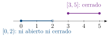

La clasificación de puntos de la sección anterior se traslada ahora a
conjuntos completos: un conjunto es abierto cuando todos sus puntos son
interiores a él, y es cerrado cuando no deja fuera a ninguno de sus puntos
límite.

::: {#def-abierto-cerrado}
## Conjunto abierto y cerrado

$E\subseteq X$ es ***abierto*** si todo punto de $E$ es
interior a $E$. Es ***cerrado*** si todo punto límite de $E$
pertenece a $E$.

:::

Conviene subrayar, antes de seguir, que “abierto” y “cerrado” no son
opuestos en el sentido cotidiano de la palabra: un conjunto puede ser
ninguna de las dos cosas, y también puede ser ambas a la vez (como ocurre
con $X$ y con $\varnothing$ en cualquier espacio métrico). El intervalo
semiabierto es el ejemplo más económico de un conjunto que no es ni una
cosa ni la otra.

::: {.remark}
Sea $E=[0,1)\subseteq\mathbb{R}$. El extremo $p=0\in E$ no es interior a
$E$: para cualquier radio $r>0$, por pequeño que sea, la vecindad
$N_r(0)=(-r,r)$ contiene puntos negativos, que quedan fuera de $E$; como
$0\in E$ pero no es interior, $E$ no es abierto. Por otro lado, el punto
$1\notin E$ es punto límite de $E$: para cualquier $\varepsilon>0$, el
punto $1-\min\{\varepsilon/2,\,0.4\}$ pertenece a $E$ y dista de $1$ menos
de $\varepsilon$; como este punto límite no pertenece a $E$, $E$ tampoco es
cerrado. El intervalo $[0,2)$, en cambio, es cerrado por la izquierda y
abierto por la derecha en el mismo sentido, mostrado en la
@fig-abierto-cerrado junto con $[3,5]$, que sí es cerrado por ambos
lados.

:::

{#fig-abierto-cerrado fig-alt=“El punto relleno pertenece al conjunto; el punto hueco marca un punto límite que no pertenece al conjunto y que impide que sea cerrado.”}

El comentario anterior muestra que abierto y cerrado se verifican punto
por punto, pero la relación entre ambas nociones es, en realidad, una sola
idea vista desde dos ángulos: un conjunto es abierto exactamente cuando su
complemento no deja fuera a ninguno de sus propios puntos límite, que es
la definición misma de cerrado aplicada al complemento.

::: {#thm-abierto-complemento-cerrado}
## Un conjunto es abierto si y solo si su complemento es cerrado

$E$ es abierto si y solo si $E^c$ es cerrado.

:::

::: {.proof}
Se prueba primero que $E^c$ cerrado implica $E$ abierto. Sea $p\in E$;
entonces $p\notin E^c$, y como $E^c$ es cerrado, $p$ no puede ser punto
límite de $E^c$, de modo que existe una vecindad $N$ de $p$ que no
interseca a $E^c$, es decir,

$$
N \subseteq E.
$$

Por lo tanto $p$ es interior a $E$, y como $p$ era arbitrario, $E$ es
abierto.

Para la recíproca, supóngase $E$ abierto y sea $p$ un punto límite de
$E^c$. Toda vecindad de $p$ contiene entonces algún punto de $E^c$, así que
ninguna vecindad de $p$ puede estar contenida enteramente en $E$; como $E$
es abierto, esto obliga a que $p\notin E$, es decir,

$$
p \in E^c,
$$

con lo cual todo punto límite de $E^c$ pertenece a $E^c$, que es
exactamente lo que se quería probar.

:::

Este teorema es lo que permite, en la práctica, decidir que un conjunto es
abierto verificando que su complemento cumple la condición, más fácil de
chequear, de contener a todos sus puntos límite, y viceversa; se invocará
sin comentario cada vez que convenga cambiar de perspectiva entre un
conjunto y su complemento. La siguiente propiedad describe qué operaciones
de conjuntos preservan el carácter abierto o cerrado, y por qué una de
ellas exige una restricción que a primera vista parece innecesaria.

::: {#prp-uniones-intersecciones}
## Uniones e intersecciones de abiertos y cerrados

(i) La unión de cualquier colección de abiertos es abierta.

(i) La intersección de cualquier colección de cerrados es cerrada.

(i) La intersección de una colección *finita* de abiertos es
            abierta.

(i) La unión de una colección *finita* de cerrados es cerrada.

:::

::: {.proof}
Para (i), sea $\{G_\alpha\}$ una colección de abiertos y
$G:=\bigcup_\alpha G_\alpha$. Si $p\in G$, entonces $p\in G_\alpha$ para
algún $\alpha$, y como $G_\alpha$ es abierto, $p$ es interior a $G_\alpha$;
toda vecindad de $p$ contenida en $G_\alpha$ también está contenida en el
conjunto más grande $G$, así que $p$ es interior a $G$.

Para (iii), sea $\{G_1,\ldots,G_n\}$ una colección *finita* y
$H:=\bigcap_{i=1}^{n}G_i$. Si $p\in H$, para cada $i$ existe un radio
$r_i>0$ con $N_{r_i}(p)\subseteq G_i$, y como la colección de radios
$r_1,\ldots,r_n$ es finita, tiene un mínimo positivo,

$$
r := \min\{r_1,\ldots,r_n\} > 0,
$$

que satisface $N_r(p)\subseteq G_i$ para todo $i$ simultáneamente, y por
lo tanto $N_r(p)\subseteq H$. Aquí es donde la finitud resulta
indispensable: con infinitos radios $r_i$, el ínfimo podría ser cero y
ningún radio positivo funcionaría para todos a la vez.

Las partes (ii) y (iv) se obtienen de (i) y (iii), respectivamente,
tomando complementos y aplicando las leyes de De Morgan junto con el
@thm-abierto-complemento-cerrado.

:::

La advertencia sobre la finitud en (iii) no es un tecnicismo vacío, y el
siguiente conjunto de intervalos lo demuestra con un cálculo explícito del
límite de la intersección.

::: {#exm-interseccion-infinita-no-abierta}
## Por qué la intersección de infinitos abiertos puede no ser abierta

Sea $G_n:=\left(-\frac1n,\frac1n\right)$ para cada $n\in\mathbb{N}$, cada
uno abierto. Su intersección es

$$
\bigcap_{n=1}^{\infty} G_n = \{0\},
$$

porque cualquier $x\neq0$ queda excluido tan pronto $n$ sea, por la
propiedad arquimediana, suficientemente grande para que $1/n<|x|$; con
$x=0.001$, por ejemplo, ya $x\notin G_{1001}$, pues $1/1001<0.001$. Pero
$\{0\}$ no es abierto, según la @def-abierto-cerrado: ninguna
vecindad de $0$, sin importar cuán pequeña, está contenida en $\{0\}$,
porque toda vecindad de radio positivo contiene infinitos puntos distintos
de $0$. Esto confirma, con un caso concreto, por qué la
@prp-uniones-intersecciones(iii) exige que la colección sea finita.

:::

Hasta aquí, “abierto” y “cerrado” describen propiedades de un conjunto
respecto de sí mismo. La siguiente construcción asigna a cualquier
conjunto, sea o no cerrado, el conjunto cerrado más pequeño que lo
contiene.

::: {#def-clausura}
## Clausura

$\overline{E}:=E\cup E'$, donde $E'$ es el conjunto de puntos límite de
$E$.

:::

La clausura simplemente añade a $E$ los puntos límite que le faltaban;
por construcción, entonces, debería ser un conjunto cerrado, y de hecho
debería ser el más pequeño con esa propiedad que aún contiene a $E$. El
siguiente teorema confirma ambas expectativas y añade una tercera
propiedad, la de minimalidad, que es la que en la práctica resulta más
útil.

::: {#thm-clausura}
## Propiedades de la clausura

Para todo $E\subseteq X$: (i) $\overline{E}$ es cerrado; (ii)
$E=\overline{E}$ si y solo si $E$ es cerrado; (iii) si $F$ es cerrado y
$E\subseteq F$, entonces $\overline{E}\subseteq F$. En particular,
$\overline{E}$ es el conjunto cerrado más pequeño que contiene a $E$.

:::

::: {.proof}
Se prueba primero (i). Sea $p\notin\overline{E}$; como
$p\notin E\cup E'$, existe una vecindad $N$ de $p$ que no interseca a $E$.
Esa misma $N$ tampoco interseca a $E'$: si existiera $q\in N\cap E'$, la
propia $N$ sería una vecindad de $q$ y, por ser abierta según la
[Proposición “Toda vecindad es abierta en el sentido de la Cref{def:abierto-cerrado}”](24-vecindades-y-la-clasificacion-de-los-puntos-de-u.qmd#prp-vecindad-abierta), contendría una vecindad más pequeña de $q$
también disjunta de $E$, lo cual contradice que $q$ sea punto límite de
$E$. Así, $N$ no interseca a $\overline{E}=E\cup E'$, y por lo tanto
$\overline{E}$ es cerrado.

Para (ii), si $E=\overline{E}$, (i) da directamente que $E$ es cerrado; si
$E$ es cerrado, la definición de cerrado da $E'\subseteq E$, así que
$\overline{E}=E\cup E'=E$.

Para (iii), sea $F$ cerrado con $E\subseteq F$. Todo punto límite de $E$
es también punto límite de $F$, porque toda vecindad que contiene puntos
de $E$ distintos de un punto dado contiene, a fortiori, puntos de $F$; y
como $F$ es cerrado, ese punto límite pertenece a $F$. En consecuencia,
$E'\subseteq F$, y junto con $E\subseteq F$ se obtiene
$\overline{E}=E\cup E'\subseteq F$, que es exactamente la minimalidad
buscada.

:::

La parte (iii) es la que se invocará con más frecuencia en secciones
posteriores, porque reduce cualquier pregunta de la forma “¿está este
punto en la clausura de aquel conjunto?” a exhibir, o descartar, una
sucesión de puntos del conjunto que se acerque a él. Un caso particular,
que conecta esta sección con el axioma de completitud de la
[Sección “Los naturales y el principio de inducción”](11-los-naturales-y-el-principio-de-induccion.qmd), es el del supremo.

::: {#prp-sup-en-clausura}
## El supremo de un conjunto acotado pertenece a su clausura

Sea $E\subseteq\mathbb{R}$ no vacío y acotado superiormente, $y=\sup E$.
Entonces $y\in\overline{E}$.

:::

::: {.proof}
Si $y\in E$, la afirmación es inmediata. Supóngase entonces $y\notin E$.
Para cualquier $h>0$, la propiedad de aproximación del supremo
([Proposición “Caracterización del supremo mediante ε”](15-los-reales-el-axioma-de-completitud.qmd#prp-sup-epsilon)) da un elemento $x\in E$ con

$$
y - h < x < y,
$$

de modo que $x\in N_h(y)$ y $x\neq y$; como $h>0$ era arbitrario, esto
significa que toda vecindad de $y$ contiene un punto de $E$ distinto de
$y$, es decir, $y$ es punto límite de $E$. Por lo tanto
$y\in E'\subseteq\overline{E}$.

:::

Con las nociones de conjunto abierto, cerrado y clausura ya disponibles,
el resto de la sección se dedica a la propiedad más consecuente de todas:
la compacidad, que en $\mathbb{R}^k$ resultará equivalente a ser cerrado y
acotado a la vez, pero cuya definición original no menciona ninguna de las
dos cosas. La razón de dedicarle tanto espacio no es solo de rigor
matemático: la compacidad de un conjunto de parámetros es, más adelante,
la condición que garantiza que un problema de máxima verosimilitud tenga
solución y que un estimador construido como maximizador converja al
verdadero valor del parámetro, de modo que lo que aquí se desarrolla en
abstracto reaparecerá, sin que se repita el argumento, en la teoría de la
inferencia asintótica.
