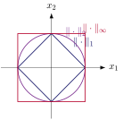

La dimensión cuenta direcciones, pero ningún resultado de esta
subsección hasta ahora permite decir que un vector es “grande” o que dos vectores están “cerca”. Para eso hace falta una función que generalice al
valor absoluto de $\mathbb{R}$ del mismo modo en que la
[Definición “Espacio métrico”](../matematica-1/23-espacios-metricos.qmd#def-espacio-metrico) generalizó la distancia usual.

::: {#def-norma}
## Norma

Sea $V$ un espacio vectorial. Una ***norma*** en $V$ es una
función $\|\cdot\|:V\to\mathbb{R}$ que satisface, para todos
$\vect{u},\vect{v}\in V$ y todo $\alpha\in\mathbb{R}$:

(i) $\|\vect{v}\|\geq 0$, con igualdad si y solo si $\vect{v}=\vect{0}$;

(i) $\|\alpha\vect{v}\| = |\alpha|\,\|\vect{v}\|$ (homogeneidad absoluta);

(i) $\|\vect{u}+\vect{v}\|\leq\|\vect{u}\|+\|\vect{v}\|$ (desigualdad
            triangular).

Al par $(V,\|\cdot\|)$ se le llama ***espacio normado***.
:::

Distintas normas sobre el mismo espacio capturan nociones de tamaño
genuinamente distintas, y esa diferencia es difícil de apreciar sin verla
dibujada: dos normas pueden coincidir en cuáles vectores son
“pequeños” y aun así discrepar drásticamente
en la forma de su bola unitaria.

::: {#exm-normas-p}
## Las normas $p$ en $\mathbb{R}^n$

Para $\vect{x}=(x_1,\ldots,x_n)\in\mathbb{R}^n$ y $p\geq 1$, la norma $p$
se define como

$$
\|\vect{x}\|_p = \Bigl(\sum_{i=1}^{n}|x_i|^{p}\Bigr)^{1/p},
$$

y el caso límite $p\to\infty$ da $\|\vect{x}\|_\infty=\max_i|x_i|$. Las
tres verifican los tres axiomas de la @def-norma, pero producen
bolas unitarias de forma distinta en $\mathbb{R}^2$: la de $\|\cdot\|_1$
es un rombo, la de $\|\cdot\|_2$ (la norma euclidiana usual) es un
círculo, y la de $\|\cdot\|_\infty$ es un cuadrado, como muestra la
@fig-bolas-unitarias. La norma euclidiana es la única de las tres
que proviene de un producto interno, en el sentido que precisa la
[Subsección “Espacios con producto interno”](04-espacios-con-producto-interno.qmd).
:::

{#fig-bolas-unitarias fig-alt=“Bolas unitarias en $\mathbb{R}^2$ para las normas $1$, $2$ e $\infty$. Los tres conjuntos contienen al origen y son simétricos, pero ninguno es una versión reescalada de otro.”}

Con una norma fijada, el espacio vectorial hereda automáticamente una
estructura métrica, lo que conecta esta subsección con la
[Sección “Espacios métricos”](../matematica-1/23-espacios-metricos.qmd) sin necesidad de volver a verificar sus axiomas desde
cero.

::: {#prp-norma-induce-metrica}
## Toda norma induce una métrica

Si $\|\cdot\|$ es una norma en $V$, la función
$d(\vect{u},\vect{v}):=\|\vect{u}-\vect{v}\|$ es una métrica en $V$ en el
sentido de la [Definición “Espacio métrico”](../matematica-1/23-espacios-metricos.qmd#def-espacio-metrico).
:::

::: {.proof}
Las tres condiciones de la [Definición “Espacio métrico”](../matematica-1/23-espacios-metricos.qmd#def-espacio-metrico) se verifican
directamente a partir de los axiomas de la norma. La no negatividad y la
condición de igualdad se siguen del axioma (i): $d(\vect{u},\vect{v})=
\|\vect{u}-\vect{v}\|\geq 0$, con igualdad si y solo si
$\vect{u}-\vect{v}=\vect{0}$, es decir, si y solo si $\vect{u}=\vect{v}$.
La simetría se sigue del axioma (ii) tomando $\alpha=-1$, puesto que
$\|\vect{u}-\vect{v}\|=\|(-1)(\vect{v}-\vect{u})\|=\|\vect{v}-\vect{u}\|$.
Para la desigualdad triangular, el axioma (iii) aplicado a los vectores
$\vect{u}-\vect{w}$ y $\vect{w}-\vect{v}$ da

$$
d(\vect{u},\vect{v}) = \|\vect{u}-\vect{v}\|
  = \|(\vect{u}-\vect{w})+(\vect{w}-\vect{v})\|
  \leq \|\vect{u}-\vect{w}\| + \|\vect{w}-\vect{v}\|
  = d(\vect{u},\vect{w}) + d(\vect{w},\vect{v}),
$$

que es exactamente la tercera condición de la [Definición “Espacio métrico”](../matematica-1/23-espacios-metricos.qmd#def-espacio-metrico).
:::

Esta proposición es la que permite, a partir de aquí, aplicar sin
comentario adicional todo lo desarrollado en la [Sección “Espacios métricos”](../matematica-1/23-espacios-metricos.qmd) sobre
vecindades, conjuntos abiertos y compacidad a cualquier espacio normado
que aparezca más adelante, incluyendo el espacio de parámetros de un
modelo econométrico dotado de la norma euclidiana.
